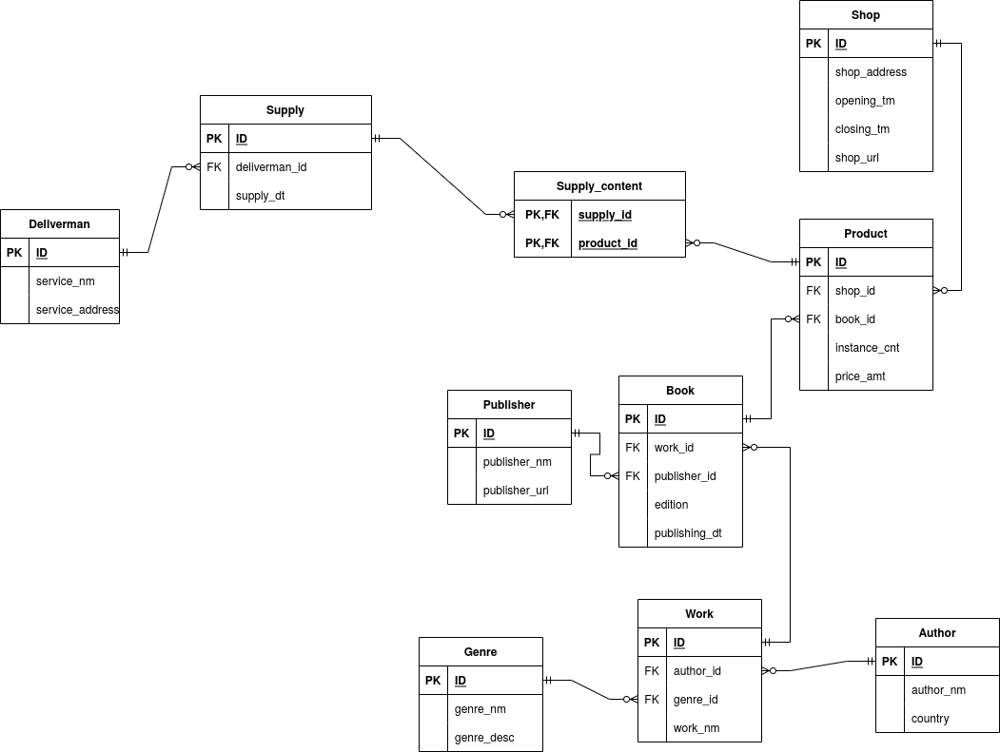

# Проект по курс Базы Данных весна 2022

## Тема: схема книжных магазинов

У меня тема сеть книжных магазинов.

### Мои сущности:  
1) Book - объект книги, у него есть издатель и сама работа, версия и дата печатания  
2) Work - работа(труд), это само произведение, у него есть жанр(тип), автор и название  
3) Author - автор, у него есть имя и его страна  
4) Genre - жанр, у него есть название и описание  
5) Publisher - издатель(тот кто печатает), у него есть название и ссылка на сайт  
6) Product - товар в магазине, хранит какой магазин, какая книга, цена и количество  
7) Shop - магазин(Дистрибьютор), хранит адрес, время открытия и закрытия и ссылку на сайт  
8) Deliverman - доставщик, имеет поля id, sevice_nm, service_address(адресс)
9) Supply - поставка, имеет поля id, deliverman_id и supply_dt(дата)  
10) Supply_content - содержание supply'я, имеет поля supply_id, product_id  
---
## Логическая схема(исправленная):

  
  
---
## Физическая модель

Физическую можель можно посмотреть в папке docs.  
Достаточно нажать на эту кнопку: [Физическая модель](./docs/fiz.pdf "открыть физическую модель").

---
## Select запросы  

### Ожидания:  
1) Должен вернуть название всех книг(book) жанра "Роман", выпущенные до 2000 года
2) Должен вернуть названия всех произведений информация о которых отсутствует в supply_content
3) Должен посчитать количество произведений каждого жанра и вывести их в порядке увелчения номера жанра.
4) Должен вернуть сумаруню цену всез книг в каждом магазине.
5) Должен вернуть самых популярных доставщиков(самое большое количество поставок)
6) Должен вернуть самых широко предстваленных авторов

---
## Index

### Индексы в таблицах  
1) В таблице author, по столбцу author_nm, т.к. в основном нам удобнее искать информацию по имени автора
2) В таблице book, по столбцу publishing_dt, т.к. самая комплексная фильтрация будет по дате, остальное просто индексы
3) В таблице deliverman, по столбцу id. Единственный информативный столбец по которому можно делать поиск.
4) В таблице genre, по столбцу genre_nm, т.к. по имени намного удобнее делать фильтрацию чем по id.
5) В таблице product, по столбцам shop_id, book_id, т.к. чаще всего фильтрация будет по магазинам или книгам.
6) В таблице publisher, по столбцу id, т.к. во всех запросах будет отсеивание по id.
7) В таблице shop, по столбцу id, т.к. для фильтрации опять таки будет использоваться id магазина.
8) В таблице supply, по столбцу deliverman_id, чаще всего будет интересно какие поставки были от какого доставщика.
9) В таблице supply_content, по столбцам supply_id и product_id, других стольцов нет, а делать по одному из них не имеет смысла т.к. столбцы равнозначны
10) В таблице work, по столбцам author_id и genre_id, т.к. нас интересуют работы от каких то авторов или каких-то жанров.

---

## View

### Список представлений:
1) Представляет собой сводную таблицу по поставкам(id поставки, что поставляли, кому и кто был доставщиком)
2) Статистика по магазинам(количество товара, сумарная стоимость представленного товара)
3) Статистика по жанрам (название, сколько экзепляров работ этого жанра)
4) Статистика по издателям(id, название издателя, количество напечатанных экзепляров, суммарная цена всех напечатанных экземпляров)
5) Таблица состаящая из названия произведения и типа цены(дешевая < $400 или дорагая >= $400). При этом сама цена не хранится(сокрытие)
6) Представляет собой некую сборную информацию об авторе(имя, пример работы, и страна). Причем страна может принимать значение либо Россия, либо Зарубежный(такое вот цензурное сокрытие)

--- 

## Procedures

### Список процедур
1) buy_book(product_id INT, cnt INT)  
   Семантика, если экземпляров product_id хватает для покупки, то покупаем.  
    Иначе ничего не делаем.  
    Реализация такова, что можно добавлять новые экземпляры в product_id,  
    если cnt отрицательный, то есть:  
        buy_book(10, -100) = добавить 100 экземпляров книг с product_id = 10
2) add_new_work(_work_nm VARCHAR(100), _author_id INT, _genre_id INT, _work_id INT DEFAULT -1)  
    Семантика, создаем новое произведение в таблице с заданными значениями  
    Если _work_id не указан то берется максимальный уже существующий и прибавляется 1

---

## Trigers

### Список тригеров
1) --
2) --

---

## Вставка используя язык программирования

### Язык: Python  
### Что происходит:  

